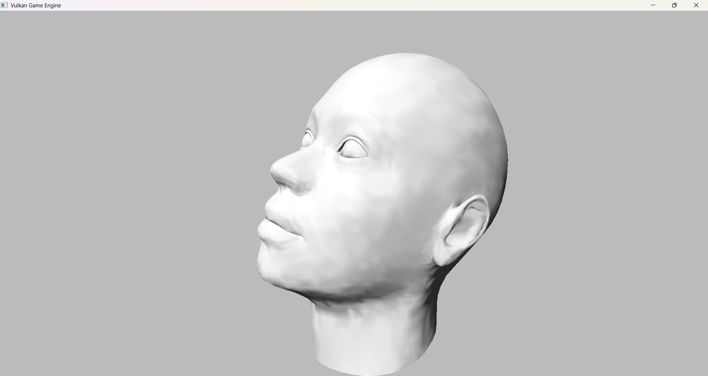

# RELAMPIÂO



A simple 3D game engine built with Vulkan and GLFW in C++. This project serves as a learning implementation of modern graphics programming using the Vulkan API.

## Features

- **3D Rendering**: Basic 3D object rendering using Vulkan
- **Window Management**: GLFW integration for cross-platform window creation
- **Modern Graphics API**: Utilizes Vulkan for high-performance graphics
- **C++ Implementation**: Written in modern C++
- **Automatic Shader Compilation**: GLSL shaders are automatically compiled to SPIR-V during build

## Prerequisites

Before building, ensure you have the following installed:

- **Visual Studio 2022** (or newer) with C++ tools
- **Vulkan SDK** (version 1.2 or higher)
- **CMake** (version 3.11 or higher)

## Project Setup

### 1. Environment Configuration

Create a `.env.cmake` file in the project root to specify dependency paths:

```cmake
# Example .env.cmake file for Windows/Visual Studio
set(VULKAN_SDK_PATH "C:/VulkanSDK/1.3.250.1")  # Path to your Vulkan SDK
set(GLFW_PATH "C:/libs/glfw-3.4")              # Path to GLFW installation
set(TINYOBJ_PATH "C:/libs/tinyobjloader")      # Path to tinyobjloader
set(GLM_PATH "C:/libs/glm")                    # Path to GLM mathematics library
```

### 2. Dependency Installation

#### Windows with Visual Studio
- **Vulkan SDK**: Download from [vulkan.lunarg.com](https://vulkan.lunarg.com/)
- **GLFW**: Download precompiled binaries (use the `lib-vc2022` folder for Visual Studio 2022)

## Building the Project

### Standard Build with Visual Studio

```bash
# Clone the repository
git clone <repository-url>
cd VulkanGameEngine

# Create and enter build directory
mkdir build
cd build

# Configure with CMake (this generates Visual Studio solution)
cmake -S ../ -B .

# Now open the generated solution in Visual Studio:
# - Open build/VulkanGameEngine.sln
# - Build from IDE (F7 or Build → Build Solution)
# - Run from IDE (F5 or Debug → Start Debugging)
```

### Alternative: Command Line Build

```bash
# After running cmake -S ../ -B .
# Build from command line using MSBuild
cmake --build . --config Debug
cmake --build . --config Release

# Or build specific configuration
msbuild VulkanGameEngine.sln /p:Configuration=Debug
msbuild VulkanGameEngine.sln /p:Configuration=Release
```

### Running the Executable

After successful build, the executable will be located at:
```
build/Debug/VulkanGameEngine.exe     # Debug build
build/Release/VulkanGameEngine.exe   # Release build
```

You can run it directly or through Visual Studio debugger.

## Shader Compilation

The build system automatically compiles GLSL shaders to SPIR-V:
- Shaders are located in the `Shaders/` directory
- Compiled shaders are output to `Shaders/compiled/`
- Shaders are automatically copied to the build output directory
- Shader compilation happens during the build process in Visual Studio

### Manual Shader Compilation (if needed)

```bash
# Using Vulkan SDK's glslangValidator
glslangValidator -V Shaders/triangle.vert -o Shaders/compiled/triangle.vert.spv
glslangValidator -V Shaders/triangle.frag -o Shaders/compiled/triangle.frag.spv
```

## Project Structure

```
VulkanGameEngine/
├── src/                 # Source files
│   ├── Headers/        # Header files (.hpp, .h)
├── Shaders/            # Vulkan shader files
│   ├── compiled/       # Auto-generated SPIR-V shaders
├── build/              # Build directory (created)
│   ├── Debug/         # Debug build output
│   ├── Release/       # Release build output
│   └── VulkanGameEngine.sln  # Visual Studio solution
├── .env.cmake         # Environment configuration
└── CMakeLists.txt     # Build configuration
```

## Visual Studio Specific Notes

- The CMake configuration sets the proper working directory for debugging
- Shader compilation is integrated as a pre-build step
- Both Debug and Release configurations are supported
- Use Visual Studio's debugger to step through Vulkan code

## Troubleshooting

### Common Issues

1. **CMake Configuration Fails**
   - Verify all paths in `.env.cmake` are correct
   - Ensure Vulkan SDK is installed and `VULKAN_SDK_PATH` points to the correct version

2. **GLFW Not Found**
   - Check `GLFW_PATH` in `.env.cmake` points to GLFW with `lib-vc2022` folder
   - Download GLFW precompiled binaries for Windows

3. **Linker Errors**
   - Ensure you're using the correct Visual Studio version (2022 recommended)
   - Verify all dependency paths are correct

4. **Shader Compilation Issues**
   - Check that `glslangValidator` is available in your PATH (comes with Vulkan SDK)
   - Verify shader file syntax

### Debug Tips in Visual Studio

- Enable Vulkan validation layers for debugging
- Use Visual Studio's GPU debugging capabilities
- Check the Output window for shader compilation messages
- Set breakpoints in Vulkan initialization code

## Acknowledgments

This project was developed following tutorials and resources from:
- Brendan Galea's Vulkan tutorial series
- [Vulkan Tutorial](https://vulkan-tutorial.com)

*Note: This is an educational project focused on learning Vulkan graphics programming.*
